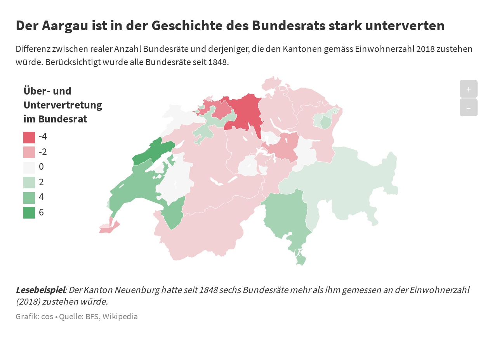

# Bundesrat Repraesentation

### Analyse des Bundesrats seit 1848





In der vorliegenden Analyse wurden für die Sonntagszeitung Lebensläufe aller 119 Bundesräte ausgewertet. Auf Basis manuell zusammengetragener Informationen (Wikipedia, Historisches Lexikon der Schweiz) und ergänzt durch vom BFS bereitgestellten Statistiken werden beschreibende Statisiken zur Regierung seit bestehen des Schweizer Bundesstaats erstellt.

Zusätzlich wurde ein Repräsentations-Index erstellt, der beschreibt wie stark die Zusammensetzung des Bundesrats die Parteienstärke in Nationalrat widerspiegelt. 

Zum Schluss wurde auf Basis der Einwohnerzahlen 2018 berechnet, wie viele Bundesratssitze (und wieviele Amtstage) einzelnen Kantonen und Regionen eigentlich zugeständen wären, wenn die Sitze nach Anzahl der Kantons-Bevölkerung verteilt würden.


#### 


**Artikel**: [Titel des Artikels (inkl. Link)](https://github.com/tamedia-ddj/brennpunkt_bauernhof_public/blob/master/1_Kuerzungen.ipynb)

**Code**: [Notebook "br_representation.ipynb"](https://github.com/tamedia-ddj/bundesraete_repraesentation_2019/blob/master/br_representation.ipynb)

**Datenquellen**: BFS, Wikipedia, Historisches Lexikon der Schweiz, Historische Statistik der Schweiz

## Inhaltsverzeichnis
1. Beschreibende Statistik Bundesrat
2. Repräsentations-Index
3. Verteilung nach Kanton und Region
4. Output-Files
5. Lizenz


## 1. Beschreibende Statistik Bundesrat

Nach dem Laden der Basisinformationen zu den Bundesräten seit 1848 aus Wikipedia ([de](https://de.wikipedia.org/wiki/Liste_der_Mitglieder_des_Schweizerischen_Bundesrates) und [en](https://en.wikipedia.org/wiki/List_of_members_of_the_Swiss_Federal_Council)), wird ein csv exportiert (`internal/data_edit.csv`), dass manuell bearbeitet werden musste. In dieser Recherche (vorwiegend stammen die Informationen von Wikipedia und/oder dem Historischen Lexikon der Schweiz) wird das csv pro Bundesrat um folgende Variablen ergänzt:

Variable | Beschreibunng
--- | --- 
`Geburtsort` | Geburtsort
`Reichtum` | Stammt die Person aus einer vermögenden Familie? (0 oder 1)
`Akad-Familie` | Hatten die Vorfahren eine akademische Bildung? (0 oder 1)
`Akademiker` | Ist die Person selbst Akademiker? (0 oder 1)
`Beruf` | Beruf vor Eintritt in den Bundesrat
`Geschlecht` | m=1, f=0

Nach erneutem Import der Datei werden für die weiteren Untersuchungen die Variable `Reichtum` und `Akad-Familie` zusammengefasst.

Die Haupttabelle für anschliessende Untersuchung ist `data`. In ihr ist für jedes Jahr seit 1848 die Zusammenstellung des Bundesrats festgehalten. Zusätzliche Informationen wie das Durschnittsalter des Bundesrats wird während des Erstellens von `data` berechnet (Aktuelles Jahr minus Geburtsjahr (ohne Tag und Monat)), weitere werden pro Jahr summiert (z.B. Anzahl weiblicher Bundesräte). Für die Zusammenstellung des Bundesrats pro Jahr, wurde alle Bundesräte berücksichtigt, die vor dem Oktober des jeweiligen Jahres im Amt waren.

Ergänzt durch Informationen des Bundesamts für Statistik und der Historischen Statistik Schweiz konnte Entwicklung einzelner Kennzahlen berechnet und zur späteren Visualisierung als csv exportiert werden:

* `output/viz_altersverteilung.csv`
* `output/viz_br_frauenanteil.csv`
* `output/viz_br_social_mobility.csv`


## 2. Repräsentations-Index

Der Repräsentations-Index soll beschreiben wie stark die Zusammensetzung des Bundesrats die Parteienstärke in Nationalrat widerspiegelt.

Die Repräsentation des Parlaments pro Bundesratspartei wurde ermittelt, indem untersucht wurde, mit welchem Anteil sie im jeweiligen Jahr im Bundesrat vertreten war. Dieser Anteil wurde mit der Parteistärke im Nationalrat verglichen. Je stärker diese Werte voneinander abweichen, desto schlechter war der Wählerwille im Bundesrat vertreten, so die Annahme. Die Summe dieser Differenzen, normalisiert auf die Skala von 0 bis 1, ergibt den Repräsentations-Index. Hohe Werte bedeuten eine gute Repräsentation, tiefe Werte eine schlechte.

Um dies zu erreichen wurden erst die Parteistärken im Parlament ermittelt. Dies geschah auf Basis der Sitzverteilung im Nationalrat. Um die Entwicklung nahtlos darzulegen, wurde die Resultate auch auf die Jahre zwischen den Nationalratswahlen ausgedehnt. Berücksichtigt wurde dabei nur Parteien die seit 1848 mindestens 1 Vertreter im Bundesrat hatten. Dies resultiert im Dataframe `partei_years`:

```
# expand data to each year (inluding years inbetween elections)
partei_years = pd.DataFrame()
index_list = []
for year in range(1848,2020):
    years = parteistaerke.Jahr.tolist()
    if (year in years):
        jahr = year
    elif (year-1 in parteistaerke.Jahr.tolist()):
        jahr = year-1
    elif (year-2 in parteistaerke.Jahr.tolist()):
        jahr = year-2
    elif (year-3 in parteistaerke.Jahr.tolist()):
        jahr = year-3

    partei_years = partei_years.append(parteistaerke[parteistaerke.Jahr == jahr][['Jahr', 'population_share_FDP/PRD', 'population_share_CVP/PDC',
       'population_share_SPS/PSS', 'population_share_SVP/UDC',
       'population_share_BDP/PBD', 'population_share_LPS/PLS']], ignore_index=True)
    index_list.append(year)
partei_years['year'] = index_list
``` 

Nun werden pro Jahr für alle Parteien die sich im jeweiligen Jahr im Bundesrat befinden, die absoluten Differenzen (keine negativen Werte) zwischen ihrem Anteil im Bundesrat und ihrem Anteil im Nationalrat berechnet. Die Summe der Differenzen aller Bundesratsparteien, zeigt nun wie Nahe die Machtverteilung im Bundesrat der Machtverteilung im Nationalrat ist. Damit die Darstellung und Interpretation dieses Wertes einfacher ist, wurde die Skala normalisiert:  `1 - (abs(difference) / 100)`

Die Resultate werden zum Schluss in folgende Datei exportiert: `output/viz_br_parties.csv`.

## 3. Verteilung nach Kanton und Region

Als Letztes wird berechnet, wie die Verteilung der Bundesratssitze nach Kantonen bzw. Regionen aussieht. Die Informationen zu Kantonen werden von Wikipia und dem BFS importiert und zusammengefasst.

Von den bereits zuvor ermittelten Informationen zu den Bundesräten (`council_merge`) welche auch den Herkunftskanton der 119 Amtsinhaber beihalten, können die Anzahl Bundesräte, die die jeweiligen Kantone seit 1848 stellten, ermittelt werden.

```
council_merge.groupby("Kanton").count()[['Name']]
```

Aus dem Datum der Wahl (`council_merge['Election']`) und dem Rücktrittsdatum (`council_merge['Left office']`) ist auch die Amtsdauer der Bundesräte bekannt. Identisch zur Anzahl Bundesräte, kann nun auch die Gesamtdauer aller Amtszeiten pro Kanton berechnet werden. Die `time_in_office` wird initial in Stunden berechnet.

```
council_merge[['Kanton', 'time_in_office']].groupby("Kanton").sum()
```

Nun sind die realen Werte von Amtsdauer und Anzahl Bundesräte pro Kanton bekannt. Zusätzlich kann aber berechnet werden, wie die Verteilung aussähe wenn die Bundesratssitze und die Amtsdauer nach Anzahl Einwohner der Kantone verteilt würde. Als zu verteilende Werte werden die Summen aller bereits verteilten Bundesratssitze (119) und die Summe aller Amtszeiten herangezogen.

Da alle Jahre zurück bis 1848 berücksichtigt werden, der Kanton Jura aber offiziell erst seit 1979 existiert, wird dessen Einwohnerzahl entsprechend gewichtet. Nun kann gewichtet nach Anzahl (gewichteter) Einwohner der Kantone im Jahr 2018 die neue Verteilung errechnet werden.
Weil insbesondere die Abweichung von den realen Werten interessiert, wird jetzt die Differenz aus realen und errechnet werden gebildet. 
Die Ergebnisse werden in die drei csvs `output/viz_kantone_br_bars_online.csv`, `output/viz_kantone_br_bars_print.csv` und `output/viz_kantone_br_map.csv` zur weiteren Visualisierung exportiert.

Identisch zu den Kantonen, kann obige Berechnung auch für Regionen durchgeführt werden. Auf Basis von vom [BFS definierten regionalen Bezugsräumen](https://www.bfs.admin.ch/bfs/de/home/statistiken/kataloge-datenbanken/medienmitteilungen.assetdetail.11611.html), werden die Kantone zusammengefasst und die Rechnung wiederholt. Die Resultate werden nach `output/viz_regions_br_bars.csv`
exportiert.


## 4. Output Files

### output/viz\_altersverteilung.csv


Variable | Beschreibunng
--- | --- 
`year ` | Jahr
`mean_age ` | Durchschnittsalter des Bundesrats im jeweiligen Jahr
`age_population` | Durchschnittsalter der CH-Bevölkerung im jeweiligen Jahr


### output/viz\_br\_frauenanteil.csv


Variable | Beschreibunng
--- | --- 
`year` | Jahr
`share_female` | Anteil weiblicher Bundesräte in jeweiligem Jahr (in %)

### output/viz\_br\_parties.csv


Variable | Beschreibunng
--- | --- 
`year` | Jahr
`BR_closeness` | Repräsentations-Index (zwischen 0 und 1) in jeweiligem Jahr

### output/viz\_br\_social\_mobility.csv


Variable | Beschreibunng
--- | --- 
`year ` | Jahr 
`nr_family ` | Anzahl Bundesräte aus vermögenden Verhältnissen bzw. aus Akademiker-Familie in jeweiligem Jahr

### output/viz\_kantone\_br\_bars\_online.csv


Variable | Beschreibunng
--- | --- 
`kte_kurz ` | Kantonsbezeichnung Abkürzung
`BR_diff ` | Differenz von realer Anzahl Bundesratssitze zur Anzahl die dem Kanton, gemessen an der Bevölkerungszahl 2018, zu stehen würde.

### output/viz\_kantone\_br\_bars\_print.csv


Variable | Beschreibunng
--- | --- 
`kte_kurz ` | Kantonsbezeichnung Abkürzung
`BR_diff ` | Differenz von realer Anzahl Bundesratssitze zur Anzahl die dem Kanton, gemessen an der Bevölkerungszahl 2018, zu stehen würde.
`time_diff ` | Differenz von realer Anzahl Amtstage im Bundesrat zur Anzahl die dem Kanton, gemessen an der Bevölkerungszahl 2018, zu stehen würde.

### output/viz\_kantone\_br\_map.csv


Variable | Beschreibunng
--- | --- 
`kte_kurz ` | Kantonsbezeichnung Abkürzung
`Kanton ` | Kantonsbezeichnung
`BR_diff ` | Differenz von realer Anzahl Bundesratssitze zur Anzahl die dem Kanton, gemessen an der Bevölkerungszahl 2018, zu stehen würde.
`time_diff ` | Differenz von realer Anzahl Amtstage im Bundesrat zur Anzahl die dem Kanton, gemessen an der Bevölkerungszahl 2018, zu stehen würde.

### output/viz\_regions\_br\_bars.csv


Variable | Beschreibunng
--- | --- 
`region ` | Region gemäss vom Bundesamt für Statistik (BFS) definierter Bezugsräume
`BR_diff ` | Differenz von realer Anzahl Bundesratssitze zur Anzahl die der Region, gemessen an der Bevölkerungszahl 2018, zu stehen würde.

## 5. Lizenz

*Bundesrat Repraesentation* is free and open source software released under the permissive MIT License.

